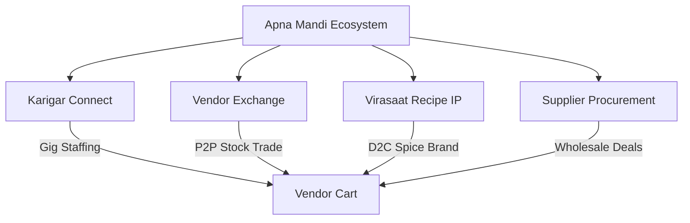
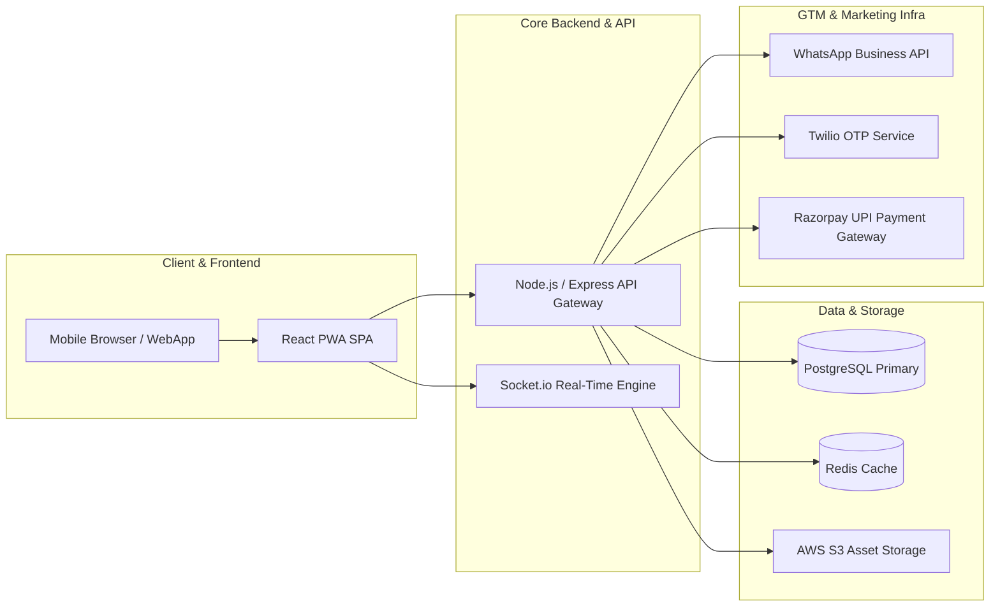
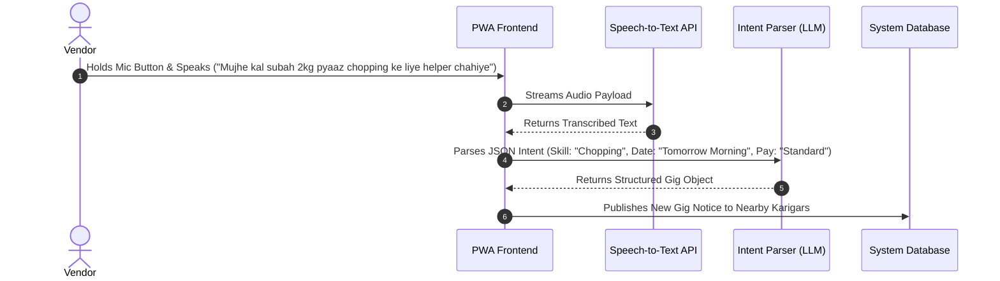

# Tutorial: Conceptualizing & Engineering Innovative Digital Products

**Target Audience:** Computer Science, Business & Digital Product Innovation Students  
**Subject:** Digital Product Management, System Architecture & Emerging Technologies  
**Case Study Reference:** [Apna Mandi](file:///e:/Apna-Mandi/README.md) — Unified Operating System for Informal Street Vendors & Micro-Merchants  

---

## Table of Contents
1. [Overview & Learning Objectives](#1-overview--learning-objectives)
2. [Tutorial Topic 01 — Conceptualizing an Innovative Digital Product](#2-tutorial-topic-01--conceptualizing-an-innovative-digital-product)
   - [1.1 Market Opportunity & Problem Discovery](#11-market-opportunity--problem-discovery)
   - [1.2 Product Vision & Multi-Module Ecosystem: Apna Mandi](#12-product-vision--multi-module-ecosystem-apna-mandi)
   - [1.3 Market Sizing (TAM / SAM / SOM)](#13-market-sizing-tam--sam--som)
   - [1.4 Student Canvas Framework for Topic 01](#14-student-canvas-framework-for-topic-01)
3. [Tutorial Topic 02 (Part A) — Infrastructure to Develop & Market the Product](#3-tutorial-topic-02-part-a--infrastructure-to-develop--market-the-product)
   - [2.1 Software & Development Architecture Infrastructure](#21-software--development-architecture-infrastructure)
   - [2.2 Hosting, Cloud & DevOps Infrastructure](#22-hosting-cloud--devops-infrastructure)
   - [2.3 Go-To-Market (GTM) & Distribution Infrastructure](#23-go-to-market-gtm--distribution-infrastructure)
4. [Tutorial Topic 02 (Part B) — Digital Technologies for Innovative Features](#4-tutorial-topic-02-part-b--digital-technologies-for-innovative-features)
   - [3.1 Technology & Feature Matrix](#31-technology--feature-matrix)
   - [3.2 Technical Deep-Dives & Implementation Snippets](#32-technical-deep-dives--implementation-snippets)
5. [Student Assignment & Evaluation Rubric](#5-student-assignment--evaluation-rubric)

---

## 1. Overview & Learning Objectives

This tutorial provides a complete walkthrough for answering two critical product engineering and market strategy challenges:

* **Topic 01:** Conceptualizing an innovative digital product or service tailored to a specific local or global market need.
* **Topic 02:** Identifying the technical and marketing infrastructure required to build, host, and distribute the product, alongside digital technologies that introduce high-impact, innovative features.

Throughout this tutorial, we examine **Apna Mandi**, a real-world mobile-first digital platform created to formalize, empower, and scale India's ~$41 Billion street food economy (~10 Million micro-vendors).

---

## 2. Tutorial Topic 01 — Conceptualizing an Innovative Digital Product

### 1.1 Market Opportunity & Problem Discovery

When imagining an innovative digital product, students must look for **unserved or underserved markets operating in friction-heavy environments**. 

#### The Target Ecosystem: India's Informal Street Economy
India’s street food ecosystem generates over **₹8,000 Crore/day (~$960M daily)** in transactions, yet millions of vendors run their businesses entirely cash-and-memory-based without basic digital tools.

```
┌─────────────────────────────────────────────────────────────────────────────┐
│                       INFORMAL STREET VENDOR FRICTIONS                       │
├──────────────────────────┬──────────────────────────┬───────────────────────┤
│ 1. Volatile Staffing     │ 2. Perishable Wastage    │ 3. Opaque Procurement │
│ Shift cancellations with │ Surplus inventory spoils │ No price discovery or │
│ no access to help.       │ while neighbors lack.    │ deal comparison.      │
├──────────────────────────┴──────────────────────────┴───────────────────────┤
│ 4. Unprotected Recipe IP         │ 5. Financial Invisibility                │
│ Legendary recipes die at cart.   │ No digital history = No bank credit.  │
└──────────────────────────────────┴──────────────────────────────────────────┘
```

---

### 1.2 Product Vision & Multi-Module Ecosystem: Apna Mandi

**Apna Mandi** is conceptualized as a unified **Hyperlocal Operating System** for street food vendors, micro-merchants, kitchen workers (*Karigars*), and wholesale suppliers.



#### Core Ecosystem Modules:
1. **🛠️ Karigar Connect (Gig Labor Marketplace):** Connects vendors with vetted kitchen staff (*Wok Masters, Dosa Tawa Experts, Chopping Helpers*) for same-day shifts or emergency coverage.
2. **🔄 Vendor Exchange (P2P Perishable Trading):** Enables neighboring vendors to sell, buy, or barter surplus ingredients (e.g., tomatoes, lemons) in real time before spoilage.
3. **🍲 Virasaat (Heritage Recipe IP & D2C Commerce):** Allows legendary street vendors to package, story-brand, protect, and sell their signature spice mixes/chutneys to national consumers.
4. **🛒 Vendor-Supplier Procurement:** A centralized deal discovery marketplace for bulk raw-material purchasing directly from verified distributors with transparent pricing.

---

### 1.3 Market Sizing (TAM / SAM / SOM)

To validate product feasibility, students must quantify market potential:

* **TAM (Total Addressable Market):** **~10 Million** street vendors in India sitting within a **$41 Billion** industry, expanding into India’s **23.5 Million** projected gig workers by 2030 and a **$941.9 Million** blended spices market.
* **SAM (Serviceable Addressable Market):** **2.5 Million** vendors across Tier-1 and Tier-2 urban metro corridors (Mumbai, Delhi NCR, Bengaluru, Pune, etc.) with high smartphone penetration.
* **SOM (Serviceable Obtainable Market):** **3,500 Vendors & 400 Karigars** in Year 1 across 1 high-density urban pilot cluster, expanding to 120,000 vendors by Year 3.

---

### 1.4 Student Canvas Framework for Topic 01

Students can apply this 5-stage framework to structure their own product ideas:

```markdown
┌────────────────────────────────────────────────────────────────────────┐
│                      DIGITAL PRODUCT CANVAS TEMPLATE                   │
├───────────────────┬────────────────────────────────────────────────────┤
│ 1. Problem Space │ What structural inefficiency exists in the market? │
├───────────────────┼────────────────────────────────────────────────────┤
│ 2. Target Persona │ Who is the core end-user (Demographics, Tech literacy)?│
├───────────────────┼────────────────────────────────────────────────────┤
│ 3. Core Modules   │ What 3-4 feature pillars solve these pain points? │
├───────────────────┼────────────────────────────────────────────────────┤
│ 4. Unique Value   │ Why can't existing platforms solve this issue?     │
├───────────────────┼────────────────────────────────────────────────────┤
│ 5. Business Model │ How does the platform generate sustainable revenue?│
└───────────────────┴────────────────────────────────────────────────────┘
```

---

## 3. Tutorial Topic 02 (Part A) — Infrastructure to Develop & Market the Product

Building and scaling a digital product requires an integrated stack spanning application development, cloud hosting, and marketing/distribution infrastructure.



### 2.1 Software & Development Architecture Infrastructure

| Layer | Recommended Infrastructure | Purpose in Case Study (Apna Mandi) |
|---|---|---|
| **Frontend Framework** | React.js / Vite SPA | Delivers high-performance, responsive UI components with lightning-fast initial load times. |
| **Mobile Access Layer** | Progressive Web App (PWA) | Enables offline installation on Android smartphones without friction or App Store downloads. |
| **State & Styling** | Context API + Vanilla/Tailwind CSS | Lightweight client state management for active carts, themes, and real-time vendor listings. |
| **Backend & API Gateway** | Node.js (Express) or Python FastAPI | Handles RESTful endpoints, worker registration, gig routing, and order processing. |
| **Real-Time Data Layer** | WebSockets / Socket.io | Powers live proximity matching for Karigar Connect and instant Vendor Exchange stock alerts. |
| **Database Systems** | PostgreSQL + Redis | PostgreSQL manages transactional schemas (orders, users, payments); Redis caches geofenced worker nodes. |
| **Payments Infrastructure** | Razorpay / Cashfree UPI PG | Facilitates low-friction micro-payments, escrow gig payouts, and instant vendor settlements. |

---

### 2.2 Hosting, Cloud & DevOps Infrastructure

1. **Cloud Host & Compute:** AWS Elastic Container Service (ECS) or Vercel edge deployment for auto-scaling frontend and API workloads during peak morning procurement hours.
2. **CDN & Security:** Cloudflare Web Application Firewall (WAF) and Global Content Delivery Network (CDN) to mitigate DDoS risks and compress static media assets.
3. **CI/CD Automation:** GitHub Actions workflows configured for automated linting, unit testing, and zero-downtime deployment pipelines.
4. **Application Telemetry & Monitoring:** Sentry for real-time frontend/backend error logging; PostHog for privacy-focused user behavior analytics.

---

### 2.3 Go-To-Market (GTM) & Distribution Infrastructure

To successfully market a product to non-traditional or low-digital-literacy demographics, conventional digital ads are insufficient. Required marketing infrastructure includes:

* **WhatsApp & SMS Gateway Infrastructure:** Integration with **WhatsApp Business API (via Twilio/Interakt)** for sending instant transactional notifications, OTP logins, and daily deal alerts directly in users' preferred chat apps.
* **On-Ground Field Force CRM:** Field agent management tools (HubSpot / Custom Field Dashboard) enabling community managers to onboard vendors at local mandis with physical QR-code starter kits.
* **Government & NGO Integration Pipelines:** API integrations with government identity frameworks (such as PM SVANidhi or local municipal vendor databases) for verified user trust verification.
* **Logistics & Order Fulfillment Infra:** Shiprocket / Delhivery API integration to manage nationwide D2C shipping for **Virasaat** recipe spice packages.

---

## 4. Tutorial Topic 02 (Part B) — Digital Technologies for Innovative Features

To make a product truly innovative, developers leverage modern digital technologies such as AI/ML, Geofencing, Blockchain, and Speech Recognition.

### 3.1 Technology & Feature Matrix

| App Module | Feature Concept | Digital Technology Employed | Value Creation & User Impact |
|---|---|---|---|
| **Karigar Connect** | Hyperlocal Emergency Gig Matching | **Geofencing & GPS Telemetry (Mapbox / Google Distance Matrix API)** | Matches vendors with verified cooks within a 2–5 km radius in under 15 minutes. |
| **All Modules** | Voice-Guided Micro-Interface | **Multilingual Voice AI & Speech-to-Text (OpenAI Whisper / Bhashini API)** | Allows low-literacy vendors to post jobs and search deals using regional voice commands. |
| **Vendor Exchange** | Perishable Stock Spoilage Predictor | **Predictive Machine Learning (Scikit-learn / Time-Series Forecasting)** | Analyzes weather and historical sales data to suggest optimal price discounts on surplus stock before it spoils. |
| **Virasaat** | Recipe IP Licensing & Proof-of-Origin | **Smart Contracts & Blockchain (Polygon / Ethereum ERC-1155)** | Encrypts vendor recipe formulations and automates royalty payouts whenever D2C products are sold. |
| **Vendor Exchange** | Low-Connectivity Offline Mode | **PWA Service Workers & IndexedDB Storage** | Enables vendors to queue trade listings offline in deep market basements, syncing automatically upon network restoration. |
| **Procurement** | Dynamic Price Comparison Engine | **Automated Scraping & Aggregation Engine (Puppeteer / ElasticSearch)** | Aggregates daily prices across regional wholesale markets to guarantee vendors get the best bulk rates. |
| **Fintech Layer** | Alternative Vendor Credit Scoring | **Embedded Micro-Fintech Analytics & Transaction Mining** | Transforms in-app trading records into formal credit scores for micro-loans via partner NBFCs. |

---

### 3.2 Technical Deep-Dives & Implementation Snippets

#### Deep-Dive 1: Hyperlocal Geofenced Gig Matching (Karigar Connect)
The following Node.js snippet calculates distance between a vendor in urgent need of assistance and nearby available Karigars using the **Haversine Formula**:

```javascript
/**
 * Calculates geographic distance (in km) between vendor and Karigar
 */
function calculateDistance(lat1, lon1, lat2, lon2) {
    const R = 6371; // Earth's radius in kilometers
    const dLat = (lat2 - lat1) * (Math.PI / 180);
    const dLon = (lon2 - lon1) * (Math.PI / 180);
    
    const a = 
        Math.sin(dLat / 2) * Math.sin(dLat / 2) +
        Math.cos(lat1 * (Math.PI / 180)) * Math.cos(lat2 * (Math.PI / 180)) * 
        Math.sin(dLon / 2) * Math.sin(dLon / 2);
        
    const c = 2 * Math.atan2(Math.sqrt(a), Math.sqrt(1 - a));
    return R * c; // Distance in km
}

// Example usage: Matching Karigars within 3km radius
const vendorLoc = { lat: 19.0596, lon: 72.8295 }; // Bandra West, Mumbai
const karigars = [
    { id: "K101", name: "Ramesh (Dosa Master)", lat: 19.0620, lon: 72.8350 },
    { id: "K102", name: "Suresh (Wok Helper)", lat: 19.1100, lon: 72.8500 }
];

const nearbyKarigars = karigars.filter(k => 
    calculateDistance(vendorLoc.lat, vendorLoc.lon, k.lat, k.lon) <= 3.0
);

console.log("Matched Nearby Karigars:", nearbyKarigars);
```

---

#### Deep-Dive 2: Voice-to-Action NLP for Low-Literacy Users (Voice AI Integration)
By integrating AI Speech-to-Text models (like India's **Bhashini API** or **OpenAI Whisper**), vendors can speak naturally in local languages (e.g., Hindi, Marathi, Tamil) to automatically populate gig forms.



---

#### Deep-Dive 3: Blockchain Smart Contract for Recipe IP Monetization (Virasaat)
Below is a simplified Solidity smart contract demonstrating automated royalty distribution to a street vendor whenever their branded recipe product is purchased via the **Virasaat** D2C store:

```solidity
// SPDX-License-Identifier: MIT
pragma solidity ^0.8.20;

contract VirasaatRecipeIP {
    address public platformAdmin;

    struct RecipeProduct {
        uint256 id;
        string recipeName;
        address payable vendorAddress;
        uint256 priceInWei;
        uint256 vendorRoyaltyPercent; // e.g., 80 = 80% to vendor, 20% to platform
    }

    mapping(uint256 => RecipeProduct) public recipes;

    event ProductPurchased(uint256 indexed recipeId, address buyer, uint256 vendorPayout, uint256 platformFee);

    constructor() {
        platformAdmin = msg.sender;
    }

    function purchaseRecipeProduct(uint256 _recipeId) external payable {
        RecipeProduct storage recipe = recipes[_recipeId];
        require(msg.value == recipe.priceInWei, "Incorrect payment amount");

        uint256 vendorPayout = (msg.value * recipe.vendorRoyaltyPercent) / 100;
        uint256 platformFee = msg.value - vendorPayout;

        // Automated multi-party payout
        recipe.vendorAddress.transfer(vendorPayout);
        payable(platformAdmin).transfer(platformFee);

        emit ProductPurchased(_recipeId, msg.sender, vendorPayout, platformFee);
    }
}
```

---

## 5. Student Assignment & Evaluation Rubric

### 📋 Student Task
1. **Part 1 (Topic 01):** Select an underserved target market in your region (e.g., local artisan crafts, rural healthcare diagnostics, waste management). Define a digital product with at least 3 core modules and specify its TAM/SAM/SOM.
2. **Part 2 (Topic 02):** Design the system architecture map. Identify 2 backend development frameworks, cloud hosting requirements, marketing/distribution infrastructure, and at least 3 innovative digital technologies (e.g., AI, IoT, Geofencing, Blockchain) used to power smart features.

---

### 📊 Evaluation Rubric

| Criteria | Outstanding (90–100%) | Satisfactory (70–89%) | Needs Improvement (<70%) |
|---|---|---|---|
| **Product Concept & Innovation** | Solves a clear, validated market pain point with unique multi-module synergy. | Addresses a standard problem with basic features. | Vague product idea with weak market justification. |
| **Infrastructure Planning** | Complete architectural breakdown spanning frontend, backend, cloud host, database, and marketing channels. | Missing some infrastructure elements (e.g., no payment or GTM plan). | Incomplete or unrealistic tech stack choice. |
| **Technology Integration** | Articulates clear code/architecture implementations for technologies like Geofencing, AI, or Smart Contracts. | Mentions technologies without explaining technical implementation. | Generic technology buzzwords used without context. |

---

> 💡 **Reference Repository:** Review the live source code and mock implementations of Apna Mandi in the codebase:
> - Product Features & Pitch Data: [PITCH_DECK_CONTENT.md](file:///e:/Apna-Mandi/PITCH_DECK_CONTENT.md)
> - Prompt Specifications: [NOTEBOOK_LM_PROMPT.md](file:///e:/Apna-Mandi/NOTEBOOK_LM_PROMPT.md)
> - Application Source: [src/App.jsx](file:///e:/Apna-Mandi/src/App.jsx)
